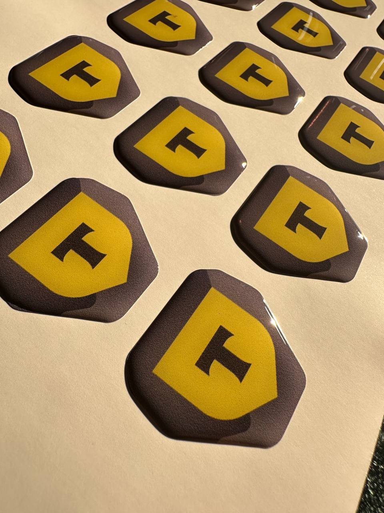
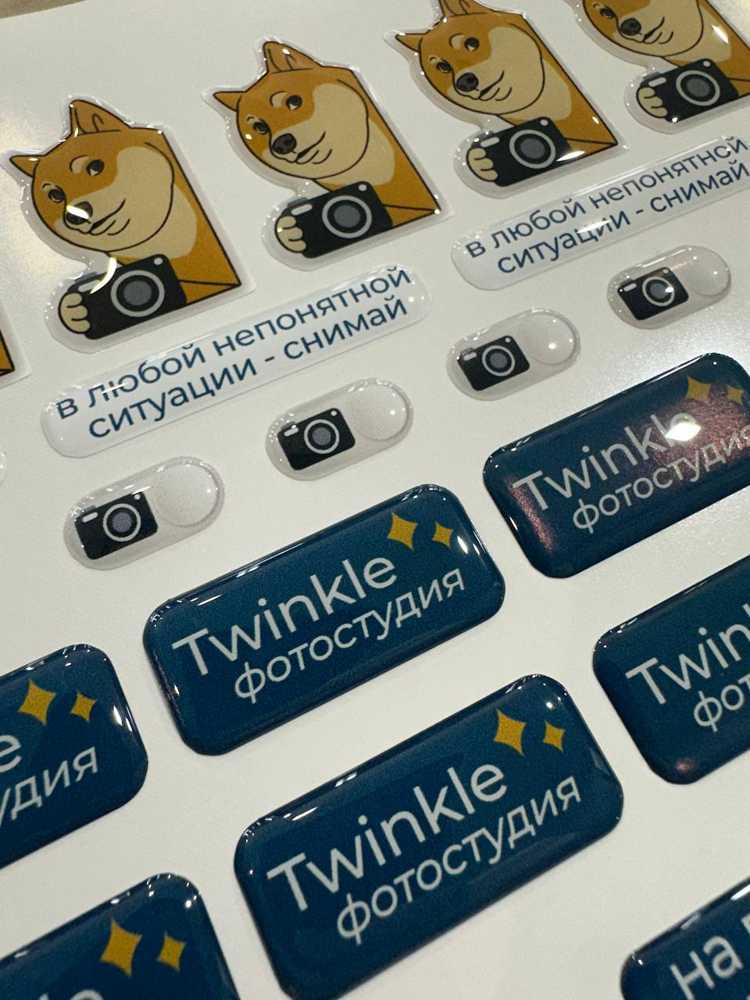

# Техническое задание: доработка сайта SMS (печать наклеек)

Этот файл содержит список конкретных правок для сайта.
Правки разделены по приоритету: СРОЧНО → ВАЖНО → ЖЕЛАТЕЛЬНО.

---

## Контекст

Сайт: one-page landing для компании SMS — печать наклеек и 3D стикеров на заказ.
Стек: статический HTML/CSS/JS, задеплоен на Netlify.
Структура страницы: Hero → Преимущества → Продукция → Отзывы → Портфолио → Процесс → Форма → Footer.

---

## СРОЧНО (критические проблемы)

### 1. Починить нерабочую ссылку на Telegram

**Проблема:** кнопка «Смотреть работы в Telegram» в секции Портфолио ведёт на `#` — никуда.

**Что сделать:**
- Найти элемент с текстом «Смотреть работы в Telegram» (скорее всего `<a href="#">`)
- Заменить `href="#"` на реальную ссылку на Telegram-канал/чат компании
- Если ссылка пока неизвестна — временно скрыть кнопку (`display: none`) или убрать из HTML, чтобы не вводить пользователей в заблуждение

---

### 2. Заменить email на корпоративный

**Проблема:** на сайте везде указан `sms.shooop@gmail.com` — Gmail выглядит несолидно и снижает доверие, особенно у B2B клиентов.

**Что сделать:**
- Найти все вхождения `sms.shooop@gmail.com` в HTML (в шапке, в футере, возможно в форме)
- Заменить на корпоративный email вида `info@[домен компании].ru`
- Обновить как отображаемый текст, так и атрибут `href="mailto:..."`

> Примечание: если домен ещё не куплен — оставить как заглушку `info@sms-print.ru` и поставить TODO-комментарий в коде.

---

### 3. Добавить пустой robots.txt и sitemap.xml

**Проблема:** файлы не существуют — поисковики не могут корректно индексировать сайт.

**Что сделать — создать `robots.txt` в корне проекта:**
```
User-agent: *
Allow: /

Sitemap: https://[домен сайта]/sitemap.xml
```

**Создать `sitemap.xml` в корне проекта:**
```xml
<?xml version="1.0" encoding="UTF-8"?>
<urlset xmlns="http://www.sitemaps.org/schemas/sitemap/0.9">
  <url>
    <loc>https://[домен сайта]/</loc>
    <lastmod>2025-01-01</lastmod>
    <changefreq>monthly</changefreq>
    <priority>1.0</priority>
  </url>
</urlset>
```

> Заменить `[домен сайта]` на реальный домен, когда он будет куплен.

---

## ВАЖНО (влияет на конверсию и доверие)

### 4. Добавить alt-атрибуты ко всем изображениям

**Проблема:** у изображений портфолио и продукции отсутствуют осмысленные alt-тексты — это плохо для SEO и доступности.

**Что сделать:** найти все теги `` и добавить описательные alt-атрибуты с ключевыми словами:

| Файл изображения | Рекомендуемый alt |
|---|---|
| `offer-surface.jpg` | `Большие наклейки для брендинга витрин и упаковки` |
| `offer-brand.jpg` | `3D стикеры объёмные и яркие на заказ` |
| `offer-3d.jpg` | `Наклейки на стекло металл пластик любую поверхность` |
| `portfolio-brand.jpg` | `Брендинговые наклейки для бизнеса и фирменного стиля` |
| `portfolio-3d.jpg` | `3D объёмные стикеры — пример работы` |
| `portfolio-figur.jpg` | `Фигурные наклейки вырубка по контуру` |
| `portfolio-etik.jpg` | `Этикетки для упаковки водостойкие` |
| `portfolio-market.jpg` | `Стикеры для маркетплейсов маркировка товаров` |
| `portfolio-gift.jpg` | `Подарочные стикеры для праздников и промо-акций` |

---

### 5. Добавить раздел FAQ

**Проблема:** пользователи уходят, не получив ответов на типовые вопросы. Нет раздела с частыми вопросами.

**Что сделать:** добавить новую секцию `<section id="faq">` после секции «Как работаем» (`#steps`) и до формы. Добавить ссылку в навигацию.

**Содержание FAQ (использовать аккордеон или простой список вопрос/ответ):**

```
В: Какие форматы макетов вы принимаете?
О: Принимаем PDF, AI (Adobe Illustrator), PNG с разрешением от 300 dpi. 
   Если макета нет — поможем подготовить за отдельную плату.

В: Какой минимальный тираж?
О: От 10 штук. Никаких требований «от 100» или «от 500».

В: Сколько стоят наклейки?
О: От 10 рублей за штуку. Точная цена зависит от размера, материала и тиража. 
   Оставьте заявку — рассчитаем за 15 минут.

В: Как долго делается заказ?
О: От 3 рабочих дней. Срочные заказы — обсуждаем индивидуально.

В: Вы присылаете визуал перед печатью?
О: Да, всегда. Перед запуском в печать согласовываем макет — вы увидите, 
   как будет выглядеть наклейка, и подтвердите.

В: Как оплатить заказ?
О: Принимаем оплату на расчётный счёт (для юрлиц) и переводом для физлиц.
   Предоплата 50%, остаток после согласования макета.

В: Есть ли бесплатная доставка?
О: Да, при заказе от 5000 рублей доставка по России бесплатна. 
   При меньшей сумме — доставка по тарифам транспортной компании.

В: Работаете ли вы с юридическими лицами?
О: Да, работаем с ООО и ИП. Предоставляем все закрывающие документы: 
   счёт, накладная, акт выполненных работ.
```

**Структура HTML секции:**
```html
<section id="faq">
  <div class="container">
    <p class="section-label">FAQ</p>
    <h2>Частые <em>вопросы</em></h2>
    <div class="faq-list">
      <!-- Повторяющийся блок для каждого вопроса -->
      <div class="faq-item">
        <button class="faq-question" aria-expanded="false">
          Какие форматы макетов вы принимаете?
        </button>
        <div class="faq-answer">
          <p>Принимаем PDF, AI, PNG от 300 dpi...</p>
        </div>
      </div>
      <!-- ... остальные вопросы -->
    </div>
  </div>
</section>
```

**Добавить в навигацию:**
```html
<a href="#faq">FAQ</a>
```

**JS для аккордеона (если не реализован):**
```javascript
document.querySelectorAll('.faq-question').forEach(btn => {
  btn.addEventListener('click', () => {
    const isOpen = btn.getAttribute('aria-expanded') === 'true';
    // Закрыть все
    document.querySelectorAll('.faq-question').forEach(b => b.setAttribute('aria-expanded', 'false'));
    // Открыть текущий (если был закрыт)
    if (!isOpen) btn.setAttribute('aria-expanded', 'true');
  });
});
```

---

### 6. Добавить юридические реквизиты в футер

**Проблема:** нет ИП/ООО, ИНН — критично для B2B клиентов, которые обязаны проверять контрагента.

**Что сделать:** в `<footer>` добавить блок с реквизитами:
```html
<div class="footer-legal">
  <p>ИП Иванов Иван Иванович &nbsp;|&nbsp; ИНН: XXXXXXXXXXXX &nbsp;|&nbsp; ОГРНИП: XXXXXXXXXXXXXXX</p>
</div>
```
> Заменить X на реальные данные. Стилизовать мелким шрифтом (12px, серый цвет) — не должно перегружать футер.

---

### 7. Добавить разметку Schema.org (LocalBusiness)

**Проблема:** нет структурированных данных — поисковики хуже понимают суть бизнеса, нет расширенных сниппетов.

**Что сделать:** добавить в `<head>` тег `<script type="application/ld+json">`:

```html
<script type="application/ld+json">
{
  "@context": "https://schema.org",
  "@type": "LocalBusiness",
  "name": "SMS — Печать наклеек и 3D стикеров",
  "description": "Печать наклеек и 3D стикеров на заказ от 10 штук. От 10 руб/шт, от 3 дней.",
  "telephone": "+79852651090",
  "email": "sms.shooop@gmail.com",
  "url": "https://[домен сайта]/",
  "priceRange": "от 10₽",
  "servesCuisine": null,
  "areaServed": "RU",
  "hasOfferCatalog": {
    "@type": "OfferCatalog",
    "name": "Наклейки и стикеры",
    "itemListElement": [
      {"@type": "Offer", "itemOffered": {"@type": "Service", "name": "Печать обычных наклеек"}},
      {"@type": "Offer", "itemOffered": {"@type": "Service", "name": "Печать 3D стикеров"}}
    ]
  }
}
</script>
```

---

### 8. Улучшить мета-теги: добавить og:image и canonical

**Проблема:** нет `og:image` — при шаринге в соцсетях не будет превью-картинки. Нет canonical — возможны дубли в индексе.

**Что сделать:** добавить в `<head>`:
```html
<!-- Canonical URL (заменить на реальный домен) -->
<link rel="canonical" href="https://[домен сайта]/" />

<!-- Open Graph изображение для соцсетей -->
<meta property="og:image" content="https://[домен сайта]/images/og-preview.jpg" />
<meta property="og:image:width" content="1200" />
<meta property="og:image:height" content="630" />
<meta property="og:url" content="https://[домен сайта]/" />

<!-- Twitter Card -->
<meta name="twitter:card" content="summary_large_image" />
<meta name="twitter:title" content="SMS — Печать наклеек и 3D стикеров на заказ" />
<meta name="twitter:description" content="Наклейки от 10 штук, от 10₽, от 3 дней. Расчёт за 15 минут!" />
<meta name="twitter:image" content="https://[домен сайта]/images/og-preview.jpg" />
```

**Создать og-preview.jpg:** изображение 1200×630px с логотипом SMS, слоганом и ключевыми УТП (от 10 шт / от 10₽ / от 3 дней).

---

## ЖЕЛАТЕЛЬНО (улучшение качества)

### 9. Заменить emoji-иконки на SVG в блоке «Преимущества»

**Проблема:** 📦 👁️ ⚡ 💪 выглядят по-любительски. SVG-иконки повышают восприятие бренда.

**Что сделать:**
- Найти карточки преимуществ с эмодзи
- Заменить на inline SVG или подключить библиотеку (например, [Lucide](https://lucide.dev/) или [Heroicons](https://heroicons.com/))
- Рекомендуемые иконки: Package, Eye, Zap, Shield (или аналоги)

Пример замены:
```html
<!-- Было -->
<div class="benefit-icon">📦</div>

<!-- Стало -->
<div class="benefit-icon">
  <svg xmlns="http://www.w3.org/2000/svg" width="32" height="32" viewBox="0 0 24 24" 
       fill="none" stroke="currentColor" stroke-width="2" stroke-linecap="round" stroke-linejoin="round">
    <!-- SVG path для иконки упаковки -->
    <path d="M21 16V8a2 2 0 0 0-1-1.73l-7-4a2 2 0 0 0-2 0l-7 4A2 2 0 0 0 3 8v8a2 2 0 0 0 1 1.73l7 4a2 2 0 0 0 2 0l7-4A2 2 0 0 0 21 16z"/>
    <polyline points="3.27 6.96 12 12.01 20.73 6.96"/>
    <line x1="12" y1="22.08" x2="12" y2="12"/>
  </svg>
</div>
```

---

### 10. Добавить счётчик Яндекс.Метрика

**Проблема:** без аналитики невозможно отслеживать конверсии и поведение пользователей.

**Что сделать:**
1. Зарегистрировать счётчик на [metrika.yandex.ru](https://metrika.yandex.ru)
2. Вставить полученный код в `<head>` перед закрывающим тегом
3. Настроить цели: отправка формы заявки, клик на телефон, клик на Telegram

```html
<!-- Яндекс.Метрика - вставить перед </head> -->
<!-- Код счётчика получить на metrika.yandex.ru -->
```

**Также добавить `rel="noopener"` на все внешние ссылки** (Telegram, tel:, mailto:) для безопасности.

---

### 11. Добавить lazy loading для изображений портфолио

**Проблема:** все изображения загружаются сразу при открытии страницы — замедляет LCP.

**Что сделать:** добавить `loading="lazy"` ко всем `` кроме первого (hero):
```html
<!-- Hero изображение — НЕ lazy (загружать сразу) -->


<!-- Все остальные изображения — lazy -->


<!-- и т.д. -->
```

---

### 12. Добавить раздел «О компании» (блок доверия)

**Проблема:** непонятно, кто стоит за брендом — нет года основания, нет фото, нет истории.

**Что сделать:** добавить небольшой блок между секцией «Преимущества» и «Продукция»:

```html
<section id="about">
  <div class="container">
    <p class="section-label">О нас</p>
    <h2>Кто мы <em>такие</em></h2>
    <div class="about-content">
      <div class="about-text">
        <p>SMS — производство наклеек и стикеров в Москве с [год] года. 
           За это время мы выполнили более 12 000 заказов для малого бизнеса, 
           handmade-мастеров и крупных брендов по всей России.</p>
        <p>Работаем на профессиональном оборудовании: [название принтеров/плоттеров]. 
           Используем только проверенные материалы — винил, полипропилен, 
           глянцевая и матовая ламинация, УФ-лак.</p>
      </div>
      <!-- Опционально: фото цеха или команды -->
    </div>
  </div>
</section>
```

> Заменить `[год]` и `[название оборудования]` на реальные данные.

---

## Проверочный чеклист после внесения правок

После всех изменений убедиться:

- [ ] Ссылка на Telegram открывает реальный канал/чат
- [ ] Email обновлён везде (шапка, футер, форма, meta)
- [ ] `robots.txt` доступен по адресу `/robots.txt`
- [ ] `sitemap.xml` доступен по адресу `/sitemap.xml`
- [ ] Все `` имеют непустой `alt`
- [ ] FAQ-секция добавлена и аккордеон работает
- [ ] Реквизиты добавлены в футер
- [ ] Schema.org разметка добавлена в `<head>`
- [ ] `og:image`, `og:url`, canonical добавлены в `<head>`
- [ ] `loading="lazy"` добавлен на изображения портфолио
- [ ] Сайт корректно отображается на мобильных (проверить в DevTools)
- [ ] Форма заявки отправляется без ошибок
- [ ] В консоли браузера нет JS-ошибок

---

*Подготовлено на основе аудита сайта https://sweet-madeleine-53a1da.netlify.app/*
